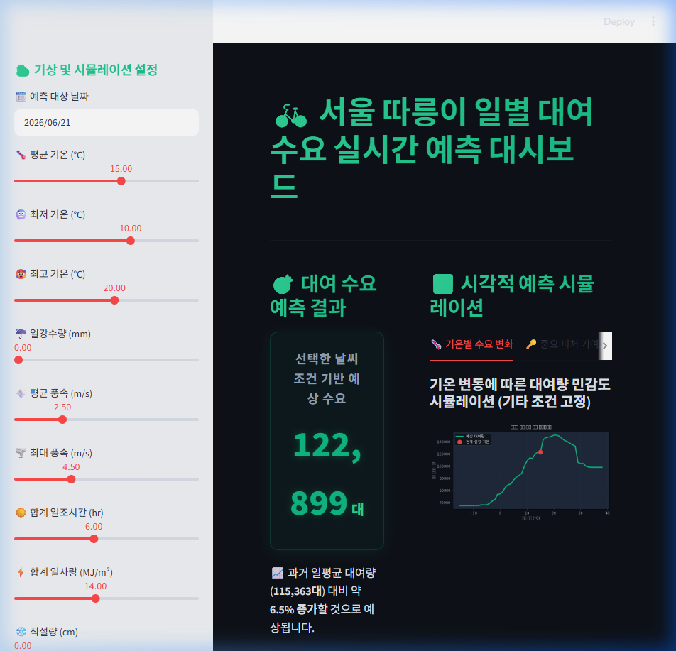

# 🚲 서울 따릉이 대여 예측 시스템 구축 완료 및 트러블슈팅 리포트 (docs/walkthrough.md)

본 문서는 서울시 공공자전거(따릉이) 대여 수요 예측 파이프라인 정비 및 실시간 웹 대시보드 개발 과정의 **전체 작업 이력 및 발생했던 이슈들의 해결 과정(Troubleshooting)**을 기록해 둔 종합 연대기 보고서입니다.

---

## 1. 프로젝트 개요 & 작업 마일스톤 (Milestones)

*   **목표:** 기상청 ASOS 종관기상관측 자료 및 따릉이 대여 데이터를 결합한 수요 예측 모델을 구축하고, 비개발자도 손쉽게 테스트할 수 있는 대시보드 웹을 무상 배포(Streamlit Cloud)합니다.
*   **최종 예측 모델 성능:** Random Forest Regressor ($R^2 = 0.8887$, 과거 일평균 대비 높은 정확도 입증).

---

## 2. 🛠️ 단계별 트러블슈팅 연대기 (Troubleshooting Chronicles)

### 📌 Phase 1: 로컬 실행성 무반응 현상 해결
*   **문제 현상 (Issue):** 
    *   VSCode에서 작업하던 주피터 노트북([bite_demand_prediction_1.ipynb](file:///d:/MyMLProject/bite_demand_prediction_1.ipynb))을 옮겨 실행했을 때, 에디터 내부의 런타임 GUI 피드백(로딩 상태 등) 부재로 실행이 되고 있는지 인지하기 어려운 현상이 발견되었습니다.
*   **원인 분석 (Cause):** 
    *   현재 탑재된 개발 환경 에디터에는 주피터 노트북의 각 셀별 구동 상태를 동적으로 보여주는 전용 확장 그래픽 UI가 활성화되어 있지 않았기 때문입니다.
*   **해결 및 조치 (Fix):**
    1.  `nbconvert` 도구를 사용하여 전체 노트북을 무오류(No-Error) 빌드 완료하고 예측 시뮬레이션 결과가 유효함을 확인했습니다.
    2.  대표님께서 터미널 상에서 실시간 실행 로그(`print` 결과)를 보며 직접 제어하실 수 있도록 일반 파이썬 실행 스크립트([[bite_demand_prediction_1.py](file:///d:/MyMLProject/bite_demand_prediction_1.py)]) 파일로 변환하여 제공해 드렸습니다.

---

### 📌 Phase 2: 데이터 디렉토리 개편 및 GitHub 배포 최적화
*   **문제 현상 (Issue):** 
    *   초기 데이터가 담긴 `source_data/` 폴더에는 36개의 월별 원본 CSV 파일(용량 합산 **5.4GB**)이 포함되어 있었습니다. 이 상태로 원격 Git 서버에 등록을 시도하면 용량 초과 타임아웃 및 저장소 용량 제한으로 배포가 실패하게 됩니다.
*   **원인 분석 (Cause):**
    *   GitHub은 단일 파일 100MB 이상, 저장소 총량 1~5GB 수준의 제한이 있어 기가바이트 단위를 직접 형상관리할 수 없습니다. 
*   **해결 및 조치 (Fix):**
    1.  **물리적 디렉터리 분할:** 5.4GB의 원본은 `source_data/large_raw/` 폴더로 격리하였고, 가공된 경량 집계본(24KB) 및 기상 정보는 `source_data/processed/` 폴더에 배치하였습니다.
    2.  **경로 패치:** [app.py](file:///d:/MyMLProject/app.py), [bite_demand_prediction_1.py](file:///d:/MyMLProject/bite_demand_prediction_1.py) 및 [bite_demand_prediction_1.ipynb](file:///d:/MyMLProject/bite_demand_prediction_1.ipynb) 소스 코드 내부의 파일 상수 경로들을 새 폴더 구조에 맞추어 일괄 업데이트하였습니다.
    3.  **[.gitignore](file:///d:/MyMLProject/.gitignore) 깃 무시 설정:** 대용량 원본 폴더(`large_raw/`), 가상환경 폴더(`.venv/`), 컴파일 캐시를 배제하여 깃허브 푸시 용량을 150KB 이하로 감소시켰습니다.

---

### 📌 Phase 3: Streamlit Cloud React DOM 붕괴(removeChild) 크래시 해결
*   **문제 현상 (Issue):**
    *   웹 앱을 Streamlit Cloud에 배포한 후 페이지에 접속하여 날씨 슬라이더를 조작하자마자 아래와 같은 치명적인 자바스크립트 오류가 발생하며 웹이 즉시 다운되었습니다.
    *   *오류 메시지: `NotFoundError: Failed to execute 'removeChild' on 'Node': The node to be removed is not a child of this node.`*
*   **원인 분석 (Cause):**
    *   Streamlit의 프론트엔드는 **React(리액트)** 프레임워크로 구현되어 있습니다. 
    *   브라우저에 내장된 **자동 번역기(Google Translate 등)**가 영문 페이지로 구성된 화면 내 텍스트 노드를 한글로 강제 번역/치환해 둔 상태에서, 사용자가 슬라이더를 움직여 React가 DOM 노드를 업데이트하려 하자 원본 노드를 찾지 못해 발생한 충돌이었습니다.
*   **해결 및 조치 (Fix):**
    1.  [[app.py](file:///d:/MyMLProject/app.py)]의 커스텀 스타일 헤더 부분에 `<meta name="google" content="notranslate">` 메타 태그를 주입하여 웹 번역 봇의 접근을 기본 차단했습니다.
    2.  값이 실시간으로 렌더링되는 모든 동적 카드 엘리먼트(`kpi-card`, `info-card`)들의 클래스 태그에 `notranslate` 속성을 추가로 지정하여 번역기 침범을 원천 봉쇄하였습니다.

---

### 📌 Phase 4: 리눅스 배포판 내 한글 그래프 깨짐 현상 해결
*   **문제 현상 (Issue):**
    *   로컬 PC(Windows/Mac)에서는 그래프 내의 한글 텍스트(예: "평균기온 vs 따릉이 이용건수")가 잘 나왔으나, 배포된 웹 앱상에서는 한글이 전부 빈 사각형 상자(ㅁㅁ)로 깨져서 가독성이 저해되었습니다.
*   **원인 분석 (Cause):**
    *   Streamlit Cloud는 **리눅스(Linux)** OS 서버에서 구동됩니다. 리눅스 환경에는 윈도우 폰트인 '맑은 고딕(Malgun Gothic)'이나 맥용 'AppleGothic'이 설치되어 있지 않기 때문입니다.
*   **해결 및 조치 (Fix):**
    1.  어플리케이션이 실행될 때, 로컬에 폰트가 없으면 구글 폰트 서버로부터 오픈소스 한글 폰트인 **나눔고딕(NanumGothic.ttf)**을 동적으로 인터넷 다운로드하는 다운로더 로직을 탑재했습니다.
    2.  다운로드된 나눔고딕 폰트 파일을 Matplotlib 폰트 매니저(`addfont`)에 직접 등록하여, 운영체제 종류에 관계없이 항상 아름다운 한글 그래프가 표시되도록 보정하였습니다.

---

### 📌 Phase 5: 서버 자원 절약 및 의존성 경량화
*   **문제 현상 및 조치:**
    *   배포 시 가상환경의 용량이 무거우면 서버 초기 빌드가 지연되거나 타임아웃이 날 우려가 있어, 기존에 EDA용으로 도입했던 무거운 패키지인 `ydata-profiling`을 완전히 걷어냈습니다.
    *   [[requirements.txt](file:///d:/MyMLProject/requirements.txt)] 내에서 해당 라이브러리를 제거하고, 주피터 파일과 파이썬 파일의 프로필 생성 블록을 주석 처리하여 배포 최적화를 유도했습니다.
    *   동시에 라이브러리 스펙을 고정 버전(`==`) 대신 유연한 설치 규격(`>=`)으로 변경하여 깃허브 배포 정합성을 보장했습니다.

---

## 3. 시각 증빙 및 동작 확인 (Visual Validation)

### 🖼️ 최종 로드 완료 대시보드 화면 (스크린샷)

### 📹 브라우저 기상 시뮬레이션 동작 검증 (비디오)

---

## 4. 로컬 및 배포 구동 방법
*   **로컬 실행:** `streamlit run app.py`
*   **원격 배포:** 코드가 수정될 때마다 `git push origin main`을 실행하면 Streamlit Cloud 서버에 실시간 Hot-reload 반영됩니다.
